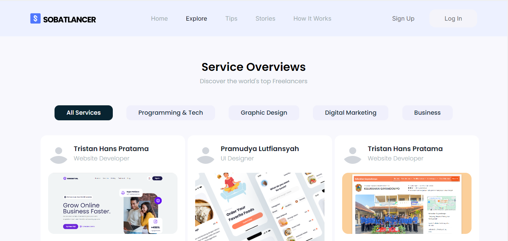
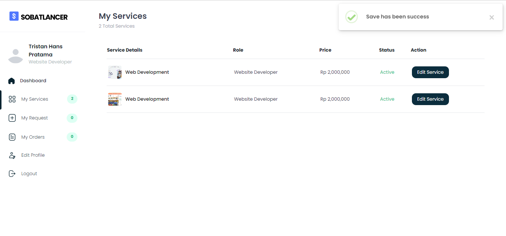
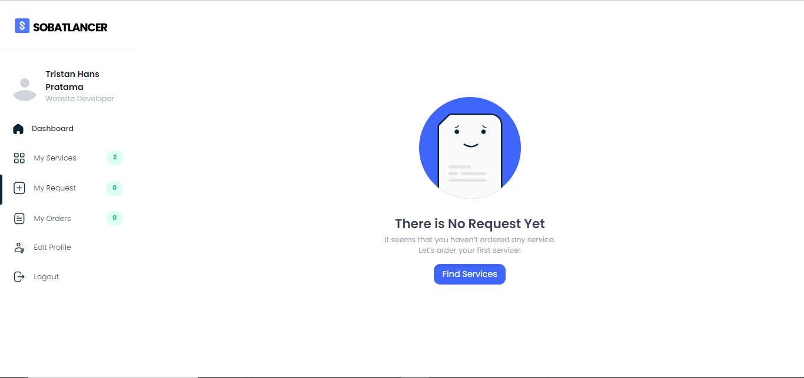
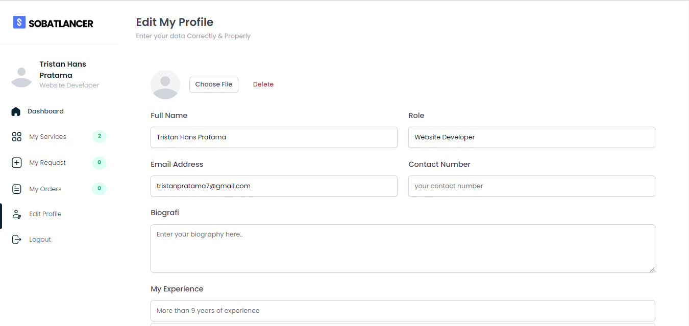
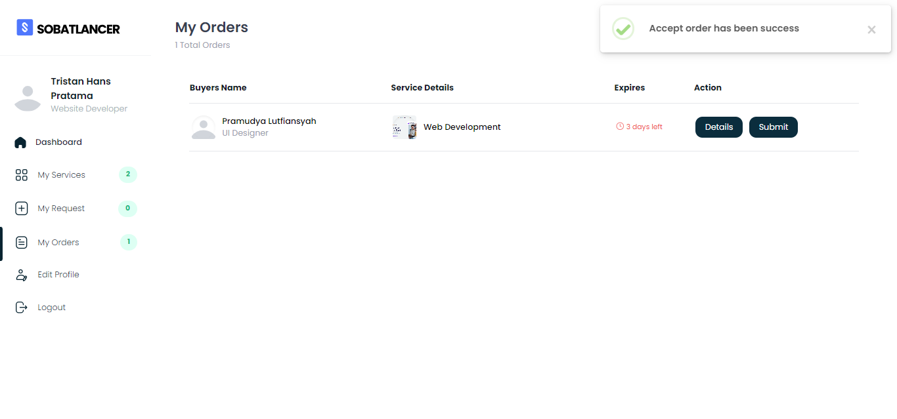

# Sobatlancer - Freelance Marketplace Platform

## 📋 Overview
Sobatlancer is a freelance marketplace platform built with Laravel 8 and Tailwind CSS, designed to connect clients with talented freelancers. This project was developed as part of the Software Engineering and Software Process course requirements.

## 🎯 Project Vision
To create a seamless platform that bridges the gap between clients seeking services and freelancers offering their expertise, fostering a vibrant freelance ecosystem in Indonesia.


## 💻 Technology Stack

### Core Technologies
- **Backend:** Laravel 8
- **Frontend:** Tailwind CSS
- **Database:** MySQL
### Server Requirements
- PHP >= 8
- Composer
- Node.js & NPM
- MySQL 5.7+

## 🚀 Installation Guide

1. Clone the repository
```bash
git clone https://github.com/yourusername/sobatlancer.git
```

2. Install PHP dependencies
```bash
composer install
```

3. Install and compile frontend dependencies
```bash
npm install && npm run dev
```

4. Setup environment file
```bash
cp .env.example .env
```

5. Generate application key
```bash
php artisan key:generate
```

6. Configure database in .env
```
DB_CONNECTION=mysql
DB_HOST=127.0.0.1
DB_PORT=3306
DB_DATABASE=sobatlancer
DB_USERNAME=root
DB_PASSWORD=
```

7. Run migrations and seeders
```bash
php artisan migrate --seed
```

8. Start the development server
```bash
php artisan serve
```

---
**Note:** This project was developed as part of the Software Engineering and Software Process course requirements. Special thanks to our mentors for their guidance and support.


## 📸 More Screenshots
### Homepage-1 Page

### Explore Page

### Service-1 Page

### Service-2 Page

### Service-3 Page

### Service-4 Page

### Service-5 Page

### Service-6 Page
